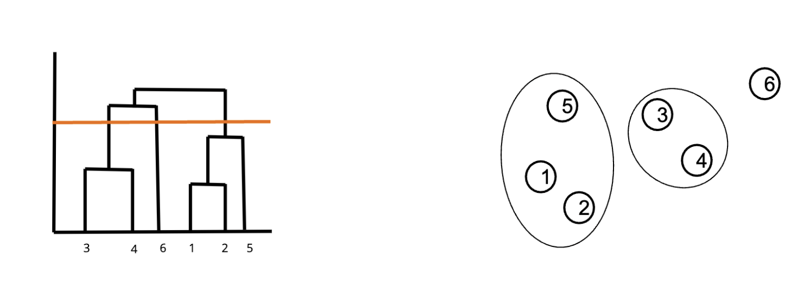

### 9/16/24
* how to collab
  * first fork the repo (essentially creates your own copy, but you gte a copy of the repo at this time)
  * clone your forked repo to your ipan (git clone <...>)
  * create remote called origin pointing to your repo
      * git remote add origin ( + forked repo link)
  * create remote called upstream pointing to the original repo
      * git remote add upstream ( + og repo link)
  * then work in your repo, add, commit
  * then make a PR to the original repo to request that your changes be reviewed and approved 
* git pull upstream main to get the changes from the og repo onto your forked repo
* git push origin main to put your changes (on you local like in your vs code) onto your forked repo (remote, like on github.com)
* whenever you develop you should be in your forked repo
  * be in main to sync the repos
  * BUT THEN when you start to actually develop cut a branch off of main!!! 
* DATA SCIENCE IS REALY REALLY HARD!
* challenges of DS
  * a set of examples may not always be representative of the underlying rule
    * like think about the triples, jsut beause you know (2, 4, 6) works, you may not be able to tell what the rule is
  * there may be infinitely many rules that match example
  * rules/examples may change over time
* all models are wrong but some are useful
* if we have a hypothesis
  * positive example: an example that follows the hypothesis
  * negative example: an example that doesn't follow hypothesis
* rule != hypothesis
  * hypothesis is literally jsut what you thinnk rule is
  * ( ( ( your hypothesis ) rule ) all possible examples ) -> sorry idk how to format
* confirmation bias: looking for and processing information that already fits in with your beliefs/hypothesis
* DS workflow
  * process data -> explore data -> extract features -> create model
    * but at any one of these step, your next option could go back to one of the previous steps, this is not a rigid workflow
    * features: what do you think impacts the outcome
* types of data
  * record: m-dimensional vector
    * i.e. (name, age, balance) -> ("john", 20, 100)
  * graphs -> adjacency matrix
  
  
### 9/18/24
* clusters can be ambiguous
    * we don't really know what the right outcome is
* types of clustering
    * partitional: each object belongs to exactly one cluster
    * hierarchical: set ofnested clusters organized in a tree (like phylogenetic tree)
    * density based: defined based on local density of points
    * soft clustering: each point is assigned to every cluster with a certain probability
* so what makes well partitioned clusters?
    * when partitions ar every overlaped -> high variance (greater spread aroudn the mean)
    * 
* cost function: way to evaluate and compare solutions
    * $\sum_{i}^{k} \sum_{x∈C}^{} d(X, \mu_i)^2$
        * where $\sum_{x∈C}^{} d(X, \mu_i)^2$ (right sum) is the variance
    * we want to find some algo that can find solutions to minimize cost
    * so like to minimize cost you have to minimize variance...?
* one way to reduce cost
    * if the "blue" points are closer to the yellow mean than the blue mean, then it's better for cost to reduce the spread of the blue cluster and assign those points to the yello wmean than trying to expand the yellow???
    * so like basically just adjust the partition by giving points from one cluster to another depending on which center those clusters are closer to
* what defines a cluster? the center!
* so how do we actually go about this alog? what algo to use? -> lloyd's algo
    * randomly place (assign) k centers (and thus make k clusters)
    * asign each point in the dataset to the closest cluster
        * don't get it twisted, you place the point in the closest cluster but that doesn;t mean the center you assigned it to is still the actual center of the cluster, it was just the closest
    * computer the new centers as the emans of each clust
    * repeat 2 & 3 until convergence
        * convergence => centers stop changing
* how do we know how many clusters.....
    * we have to figure out how to et algorithm to tell us that
* will this algo always lead to convergence? we'll see
* lloyds algorithm is not alway optimal!!
    * imagine that the true center lies righ tin the middle of two blue clusters, those clusters will neve come together even though they the same, so not optimal

### 9/23/24
* finishing lloyd's algo
    * prof way: pseudo code with what methods you'll need, then implement those functions
    * see workseet 3 for lloyds
* will lloyd's always converge? let's prove by contradiction
    * suppose it doesn't converge, then either
        * the minimum of the cost function is only reached in the limit (i.e. an infinite number of iterations, like you tryign to look at every partition ever and there are infinite??)
            * but impossibel since we are iterating over a finite set of partitions
        * the algo gets stuck in a cycle or a loop
            * not possible since this would only be possible when if you have 2 overlapping points and a randomized assignment of points to clusters, but our algo can spot that these are the same points
* does it always converge to optimal solution though?
    * no, there can be clusters that are close but don't necessarily count as an organic organic cluster as one but maybe as two
* i misssed some stufff
* k-means++: this is a combination of the two methods (decreasing randomization and choosing a point farther from ????????????????????????)
    * start with random center
    * let d(x) be the distance between x and the closest of the centers picked so far
        * choose the next center with probability proportional to $d(x)^2$
            * this allows for less randomization and for greater distance point to be more likely to be picked
* bro im crashing out
* so how do we choose the right k?
    * iterate through different values of k
    * use empirical/domain specific knowledge
    * metric for evaluating a clustering output
* so remember our goal to find a clustering such that
    * similar dtaa points are in the sae cluster
    * dissimilar data points are in different clusters
    * we wanna create clusters that are far from each other, clusters should be distinct from each other
* how could we try to define this metric that evaluates how spread out the clusters are from one another
    * maybe distance between centers
    * maybe minimum distance between points across clusters
    * make the cneter distnce but then subract the sread within one cluster, since maybe need to account for that?
* let b be the distance between centers and a be the dustanc across one center
    * if b - a = 0, this means that the clusters overlao
    * so ideally we want b - a to be large!! this means clusters are spread far apart relative to the compactness of the clusters
* but the value of b - a doesn;t really mean anything so how do we really get a meaning
    * like b - a = 5 doesn't tell us about anything
    * so do $\frac{(b - a)}{max(a, b)}$
        * if $\frac{(b - a)}{b} = 1$ then b - a is basically b, so a is really small, so that means clusters are small and there is good spread
        * if $\frac{(b - a)}{max(a, b)} = 0$, then there may be overlap
* sillhouette scores
    * for each data point i, define:
        * $a_i$: ean distnce from point i to ever other point in its cluster
        * $b_i$ smallest mean distance from point i to every point in another cluster
    * so silhouette score $s_i$ = $\frac{b_i - a_i}{max(a_i, b_i)}$
        * low silhouette score is bad...
        * you can plot silhouette score of plo to get an idea
    * how to tell if silhouette score is better...?
        * avg silhouette score across clusters good
        * clusters are all kind of similar
* point of diminishing return...
    * silhouette score plot bad if pqast the point of diminishig return

### 9/25/24
* dendrogram: tels you at what distance do you stat to merge points together becuse they are so similar
    * kind of like a phylogenetic tree
* can cut the dendrogram (like horiztonal line) to get a number of clusters
    * 
* 2 types of hierarchical
    * agglomerative
        * start with every point in its own cluser
        * at each step merge the two clsoest clusters
        * stop when every point is in the same cluster
    * divisive
        * start wtih every point in the same cluster
        * at each step split until each point is in its own cluster
    * but what's our metric for merging clusters??
* to actual split our clusters we can use kmeans
* single link distance: the minimum of all pairwise distances between a point from one cluster and a point from another cluster
    * $D_{SL}(C_1, C_2) = min\{d(p_1, p_2) | p_1 ∈ C_1, p_2 ∈ C_2\}$
    * basically look at all the possible distances between a pointin cluster A and a point in cluster B, then take the minimum distance
* so we use single link distance to decide which point to merge next into our cluster (agglomerative)
    * so if point D is closer to any point in the cluster than point C is to any pointi n the cluster, than merge D first
    * single link distance is from D, not C
* complete link distance: basically single link but now with the max pairwise distance
    * $D_{SL}(C_1, C_2) = max\{d(p_1, p_2) | p_1 ∈ C_1, p_2 ∈ C_2\}$
* i think
    * complete link distance allows us to find the distance between clusters in hierarchical clustering
    * single link distance to decide which point to merge
* average link distance: all pairwise distances, then find the average of them all
    * formula...
* centroid distance: find the distance between centroids of clusters
* ward's distance: difference between the spread/variance of pointsin  the merged clusters and the unmerged clusters
    * answers the question of what the consequence of merging points does to the variance
        * merging points can increase variance, so ward's distance lets ys see that
    * see slides for formula
* so actual agglomerative clustering algorithm
    * let each point in the dataset be in its own clustering
    * compute the distance between all pairs of clusters
    * merge the two closest clusters
    * repeat 3 & 4 until all points are in the same cluster
* density based clustering
    * dense if contains a certain amount of data points within some radius of region
* we shoudl dstinguish between poitns at the core of a dense refdion and points at the border of the dense region
    * core point: a point that has at least min_pts points withint its defined neighborhood
    * noise point: neither a core nor border (doesn't have enough points around it)
    * boider point:if it is in the neighborhood of a core point
* DBScan algorithm, given the size of the $\eps$neighborhood and min_pts
    * find the neighborhood of each point 
    * label the point as core if its enighborhood has at least min_pts
    * for each core pint, assign to the same cluster all the core points in its neighborhood
    * label points in its neighborhood that are not core as broder
    * label points as noise if neither core nor border
    * assign bordeer points to nearby clusters
* kind of like DFS, liek basically look at the nighbors of a core point and decide if they are core poitns,a nd if core then same cluster then repeat
    * basically you just look at a core and add all the core points in the neighborhood to the cluster, and like border points in the cluster ar elebaled as border, but are still in cluster
* beneifits of DBScan
    * can identify clusters of difference shapes and sizes
    * resistant to noise

### 9/30/24
* something about a zoo
* another form of clustering
    * using prabbility and weighting...
* basically in your dataset there could be the possibility that one value fro a point is more probable
    * like you could be predisposed ot being a different species in the zoo
* so now we need to consider the probabilty of being some species given tht we had previously been a different species???
    * $P(S_j|X_i) = \frac{P(X_i|S_j)P(S_j)}{P(X_i)}$
        * P(S_j): prior probability of seeing species Sj
        * P(X_ | S_j) is PDF of species S_j weights evaluatged at weighr X_i
            * liek actual weights, so what weight are you actually mor elikely to see based on weight
* P(X_i_ is individual, so to combine all the species, we csan take the weighted average
    
    * $P(X_i) = \sum_{j}P(S_j)P(X_i|S_j)$
        * mixture proportion: represents the probability of belonging to Sj
        * orobabliilty of seeeing x when sampling from Sj
* maximum likelihood estimation
    * say we flip a coin 5 times and get HTTHT
        * knowing nothing about this cound except this, we'd thing Pr(H) = 2/5 = 0.4
        * but we actually did was that we found a p (bernoulli param) such that we can maximize the probability of this specific sequence happening
            * like basically the probality of a situation happening is just the bernoulli p tha amkes this possible, whichh is intuitive
* GMM: gaussian mixture model
* GMM clustering -> find the GMM that maximizes the probaility of seeing the data we have
    * remmeber:
    * $P(X_i) = \sum_{j}P(S_j)P(X_i|S_j)$
    * so basically we have to find the parameters that uniquely character this
        * params -> basically take the the probability of each individual thing (which is a GMM) and multiplu
        $$\Pi_{i}P(X_i) = \Pi_{i}\sum_{j}P(S_j)P(X_i|S_j)$$
* so how do we find the critical points of this function ^
    * we can log transform
    $$P(S_j)= \frac{1}{N}\sum_{i}P(S_j|X_i)$$
* but we are tyrtryingign to find $$P(S_j|X_i)$$
* expectation maximization algorithm
    * we're in a loop
        * in order to find one val, we need other values btu those other values depend on this one val sooooooo
    * start with randm $\mu, \Sigma, P(S_j)$
    * computer $P(S_j | X_i)$ for all Xi by using these values $\mu, \Sigma, P(S_j)$
    * computer an dupdate those $\mu, \Sigma, P(S_j)$ from $P(S_j | X_i)$
    * repeat 2 and 3 until convergence
    * these symbols are actually vectors,,,,, but for scalar jsut square them...?
* so what initialozatopms expectation maxomization algorithm? -> kmeans!

* dbscan?
    * something about density...

### 10/2/24 
* singular value decomposition
* datasets have characteristics/features that influence the values in the dataset
* we can plot/model the data set
* 
    * first one is bad because all the information in A is in B
        * 2 dimensions -> 2 features
        * 1 dimension of actual information 
        * so a high dimenstional dataset but low range/span of information
        * this is like really dedundant data, like taking on se tthen multiplying it by many constants, data isn;t really special
    * second is better, we know that if A changes, then B may change, so they don't model the same feature
        * but we don't want this either since we want to be able to isolate the effects of A and B, not that they are functions of each other
        * we don't to change A since there is a side effect of changing B
    * last is best
        * this is the case where A and B are unrelated
        * we see that as A changes, B has no change, since they ar enot related
        * this way we can isolate the effects of A and B without any changing in them
* we use SVD to get from the dataset with related features to a dataset without those linear relationships
    * only removing the linear relationsship
        * if it was liek a quadratic relationship between A and B, then we would not be able to apply SVD to remove the relationship 
    * liek from plot 2 to plot 3
* use SVD to denoise your data
    * remove noise, but not variance
* basically we go from 2 dimensional to 1 dimensional by either projecteding onto one of the features
    * would wanna project on whichever results in the dataset that still captures all the variance in our dataset
* so an example of the data
    * 
        * so we have m features, then n points
* goal: examine this matrix and uncover its linear algebraic proporties to
    * approximate A with a smaller matrix B that is easier to store but contains similar info as A
    * dimensionality reduction/feature extraction (actually reduce the number of features)
        * remove linear relationships
        * combine some features to better express variance (like if 2 * age - 3 * distance is better to capture variance)
    * anomaly detection and denoising, like data points that are very far away from each other
* matrix factorization: decomposing a matrix into 2 components, U ad V
    * U -> n x k, k is rank
    * V = k x n
* factorization can be a better option for storage since k x n and n x k could be a lot smaller than the size of A
    * low rank matrix speeds up algorithms
* so what does k small mean?
    * rank is small
        * small amount of information contained in the dataset
            * so a lot of redundence in data, maybe many linearly dependent columns
* there's a compormise
    * we want lotta info => high rank
    * but bad for storign and efficiency
* but often times our datasets aren;t that great, there is some noise
    * which is why we want to denoise and whatnot by approximating
        * yes, woudl be lower rank, but better data structure...
* so we can use SVD in our matrix factorization to attain our desired matrices...
    * $A = UΣV^T$
        * A is matrix
        * U and V compoments, V transpose
        * 
* so we have this frobenius distance, and our goal is to minimuze frobenius distance
* basically the goal of this matrix approximation for matrix factoriation is
    * minimize frobenius distance
    * small k compared to m and n
* frobenius distance: .........
* rank = dimenstsion basically...
* example approximation
    * 
        * we have A = UΣV^T
    * eventually becomes
    
    
* so we look at this photo of the boat and we ask ourselves
    * is there a column of pixels that is similar to another column of pixels
        * if not, then full rank
* so how do we find the right k?
    do singular value plot and find elbow point
    loos at the residual error of choosing different k
* form worksheet
    * as we increase rank, we get closer and closer to what the actual dtat looks like
        * but rank doesn't need to be super high to have a pretty good approximation
* dimenstionality reduction: porject data onto the feature with least variance...?
    * dimensionatliy reduction is for feature reduction
        * multiply by something........
* usually when we do SVD we wanna mean center data -> normalize kinda
    * this allows for us to SVD with datat that has different scales
    * like if completely different units and unrelatable
* but you might not always want to do that
    * liek if they have the same units already
    * cuz then we wanna see that difference in scale
* anomaly detection
    * O = A - A^k
        * the largest rows of O are the anomalies

### 10/7/24
* latent semantic analysis -> an application of SVD
* say we have a ocllection of papers and we have counted the number of times certian words have been used
    * can we write each documnet as a vector in a space of concepts
        * like vectorizing...
    * we want to create doc to term matrix, term to concept matrix, then we could get doc to concept matrix
    * doc to term
        * represent each documnet by having 
            * inputs as documents
            * words are features
                * the precence of each word -> marcated by a 1
        * but we'll also have some filler words so somethimes we might preprocess to get rid of fillers or to lump different forms of the same word into one bin (stemming)
            * most liekly preprocessing
    * term to concept
        * we basically have each concept on each axis, then each term/feature is a vector demonstrating whch concept it is more related to
        * 
    * but we can also represent documents instead by using counts of each word/feature rather than jsut the presence
* so how do we get these representations? -> SVD
    * start with doc to term similarity
        * then SVD
            doc to concept matrix X strength og each concept X term to concept similarity
            
* but an even better way of representing documents: TfiDf
    * tf * idf
        * tf = term frequency in documnet
        * idf = $\log{\frac{\text{number of documents}}{\text{number of documents that contain that term}}}$
    * so if a word is very present, then we want to penalize because... it's not special? more redundant?
        * like the word "the " woudl probabaly be super frequent, but not important, so penalize so it won't be represented

### 10/9/24
* classification

* our data can have many classes (finite) and predictors/features
* we can use classification to build a model which is methematical model thata llows us to classify the data
* classification: assigning numeric points to a specific class/category that we try to assign our data points to
* what property/combinationo of age and tumor size is unique to malignant tumors?
    * from the class example, it could be malignant if tumor size > 1/2 age
        * this condition makes up our boundary line between categories?
    
* once we classify, we are able to distinguish points in one class from points in another and find that threshold
* sometimes we can distinguish clearly, but toher times it may not be as easy to distinguish two classes from another since there might just not be a solution
    * like if we tried to classify animals s rhinos or elephans by weight, there may be some animals where we don't know for sure but have a good guess
* the feasibility fo a classificationt ask completely depends on the relationship between the attributes/predictors and the class
    * like in the case of rhino vs. elephants and weight, there may not be a great relationship between the animal and weight, so it might not be a super feasibly classification
* so like how do we decide a good predictor?
    * i.e. can we use review lengths and number of stars (1-3) as a relationship nd use the review length as a predictor for review quality? or vice versa
    * 
        * so yes, in the third, review length is a good predictor of quality, since very little overlap of data and bigger different
        * in the second, a little bit, but the overlap might make it now as good
* correlation is not causation
    * jsut because they related doesn;t mean causation..
* how do we know we've done a good job at classification?
    * testign without cheating
        * split up our data into a trainign set and a separate testign set
        * use the training set to find patterns and create model
        * use the testing case ot evaluate the model on datat its never seen before
    * testing w/o cheating allows us to check that we have not learned a mdoel too specific to the dataset
        * no underfitting or overfitting
            * under = too loose to data
            * over = too tight to training
* that's why we need test and train
    * less mistakes made by model as we keep ttraiing and learning, but we don;t ant to learn too much (liek by trainign all the data) in case we learn somethign too specific
* if we do train on all the data, then we learn trainign too well, and test is low
* if we train not with a lot of data, then no accuracy anywhere
* outliers and noise?
* we can make mistakes during our classifications
* types of mistaes:
    * say we have a rare disease, out of 1000 data piints, only 10 have diseas, a modeel that simply tells peopel theyd ont have a disease, then accuracy is 99%, even though the model not actually be doing anything 
* lazy classification tool
* classification
    * training step: create model based on exaples and training set
    * testing steo: use model to fill in blanks of testing set and compare results of model to the tru values
* instance-based classifiers
    * use the stored trainign records to predict the class label of unseen cases
        * basiclaly liek if we've seen this data before, give it the same classsification as the previous one
    * rote-learners: perform classifgication onlu if the attributies of the unseen record exactly match a record inour trainign set
* nearest neighbor classifier
    * if there is no existing record with same attributes as our unseen record, then we can use similar records for our classification
* K nearest enighbor classifier
    * need
        * training set
        * distance function
        * value for k
    1. compute distance of unseen record to all training records
    2. identify the k nearest neighbors
    3. aggregate the labels of these k neighbors to predice the unseen record class
        * i.e. majority rule
* how do we aggregate?
    * majority rule
        * using weighted majority based on distance
            * if you are closr then you get greater weight in the majority rule
* chanigng k changes the coplexity of the model since we can look at mroe data as k increases
* we can scall attributes to get a better set of data...?
* implications of size of k
    * if k i stoo small -> sensitive to noise points/doesn't generalize wlel
    * if  is too big -> neighborhood may include points from other classes
* pros and cons of KNN
    * pros
        * simple to undersand why a given unseen record was given a particular class
    * cons
        * expensive to classify new points
        * KNN can be problematic in high dimensions

### 10/14/24
* these notes may be a little sparse
* how a decision tree works
    * given a classifier (liek the categoriues and values for the), you can use the tree to figure out what class they belong to
    * 
    * nbasically just follow the tree
* then we can use certain classifiers ot build classes, like all maried ends up being no
* algo for decision trees -> hunt's algorithm
    * recursive
        * repeatedly split the dataset on attributs
    * base cases
        * if split and all data points in same class, then can predict that class
        * if snplit and no data pitns, then predict a reasonable fault
* when we split, we want the split that provides with the most distinguishable results
    * like if one attribute gives a more dstinguishable split, then better to split on that one
* GINI index...
    * $GINI(t) = 1 - \sum_jp(j |t)^2$
    * best possible GINI is 0
    * worst GINI is 1/2, since that's when data is evenly split, not distinguishable
* combine all GINIs with a weighted average/sum
