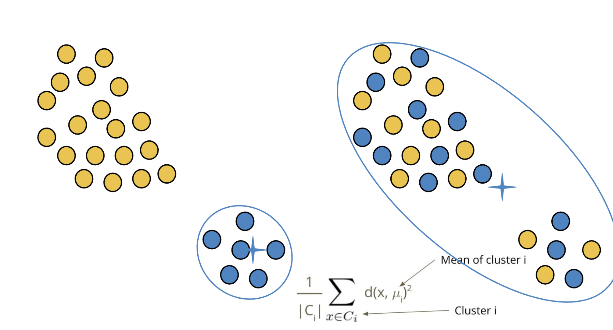

### 9/16/24
* how to collab
  * first fork the repo (essentially creates your own copy, but you gte a copy of the repo at this time)
  * clone your forked repo to your ipan (git clone <...>)
  * create remote called origin pointing to your repo
      * git remote add origin ( + forked repo link)
  * create remote called upstream pointing to the original repo
      * git remote add upstream ( + og repo link)
  * then work in your repo, add, commit
  * then make a PR to the original repo to request that your changes be reviewed and approved 
* git pull upstream main to get the changes from the og repo onto your forked repo
* git push origin main to put your changes (on you local like in your vs code) onto your forked repo (remote, like on github.com)
* whenever you develop you should be in your forked repo
  * be in main to sync the repos
  * BUT THEN when you start to actually develop cut a branch off of main!!! 
* DATA SCIENCE IS REALY REALLY HARD!
* challenges of DS
  * a set of examples may not always be representative of the underlying rule
    * like think about the triples, jsut beause you know (2, 4, 6) works, you may not be able to tell what the rule is
  * there may be infinitely many rules that match example
  * rules/examples may change over time
* all models are wrong but some are useful
* if we have a hypothesis
  * positive example: an example that follows the hypothesis
  * negative example: an example that doesn't follow hypothesis
* rule != hypothesis
  * hypothesis is literally jsut what you thinnk rule is
  * ( ( ( your hypothesis ) rule ) all possible examples ) -> sorry idk how to format
* confirmation bias: looking for and processing information that already fits in with your beliefs/hypothesis
* DS workflow
  * process data -> explore data -> extract features -> create model
    * but at any one of these step, your next option could go back to one of the previous steps, this is not a rigid workflow
    * features: what do you think impacts the outcome
* types of data
  * record: m-dimensional vector
    * i.e. (name, age, balance) -> ("john", 20, 100)
  * graphs -> adjacency matrix
  
  
### 9/18/24
* clusters can be ambiguous
    * we don't really know what the right outcome is
* types of clustering
    * partitional: each object belongs to exactly one cluster
    * hierarchical: set ofnested clusters organized in a tree (like phylogenetic tree)
    * density based: defined based on local density of points
    * soft clustering: each point is assigned to every cluster with a certain probability
* so what makes well partitioned clusters?
    * when partitions ar every overlaped -> high variance (greater spread aroudn the mean)
    * 
* cost function: way to evaluate and compare solutions
    * $\sum_{i}^{k} \sum_{x∈C}^{} d(X, \mu_i)^2$
        * where $\sum_{x∈C}^{} d(X, \mu_i)^2$ (right sum) is the variance
    * we want to find some algo that can find solutions to minimize cost
    * so like to minimize cost you have to minimize variance...?
* one way to reduce cost
    * if the "blue" points are closer to the yellow mean than the blue mean, then it's better for cost to reduce the spread of the blue cluster and assign those points to the yello wmean than trying to expand the yellow???
    * so like basically just adjust the partition by giving points from one cluster to another depending on which center those clusters are closer to
* what defines a cluster? the center!
* so how do we actually go about this alog? what algo to use? -> lloyd's algo
    * randomly place (assign) k centers (and thus make k clusters)
    * asign each point in the dataset to the closest cluster
        * don't get it twisted, you place the point in the closest cluster but that doesn;t mean the center you assigned it to is still the actual center of the cluster, it was just the closest
    * computer the new centers as the emans of each clust
    * repeat 2 & 3 until convergence
        * convergence => centers stop changing
* how do we know how many clusters.....
    * we have to figure out how to et algorithm to tell us that
* will this algo always lead to convergence? we'll see
* lloyds algorithm is not alway optimal!!
    * imagine that the true center lies righ tin the middle of two blue clusters, those clusters will neve come together even though they the same, so not optimal